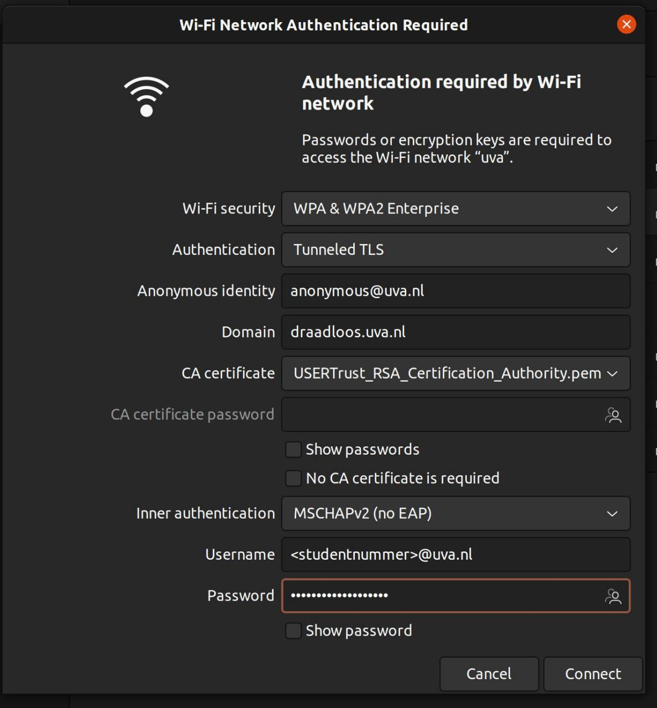

Op de Universiteit van Amsterdam en andere universiteiten en hogescholen in Europa wordt het Eduroam (uitgesproken: /ˌɛdjʊˈɹoʊm/ of /ˌɛdʒʊˈɹoʊm/) netwerk beschikbaar gesteld voor studenten om te gebruiken. Het netwerk maakt gebruik van WPA2 Enterprise, wat op Linux al ondersteund wordt door wpa_supplicant. Hierdoor is het mogelijk om de authenticiteit van het Eduroam netwerk te bevestigen m.b.v. een certificaat.

De wifi-instellingen kunnen gewoon via het wifi-menu in Ubuntu worden ingesteld.
Klik rechtsboven in het scherm om het instellingenmenu te openen. Klap het wifi-menu dan uit, en klik op __all networks__. Maak hier verbinding met het netwerk genaamd Eduroam.

Daarna verschijnt er een venster om de configuratie in te stellen, stel deze in zoals gegeven in de tabel hieronder.

Bij de optie __CA certificate__ kun je klikken op "Select from file...", en dan naar het gegeven pad navigeren via "Other Locations" > "Computer" > "etc" > "ssl" > "certs" > "Sectigo_Public_Server_Authentication_Root_R46.pem". Let op, dit certificaat is nieuw sinds 15 december 2025. Als je eerder eduroam op je laptop hebt ingesteld, moet je deze instelling mogelijk veranderen.

| | |
| - | - |
Authentication | `Tunnelled TLS` of `TTLS`
Anonymous identity | `anonymous@uva.nl`
Domain | `wireless.uva.nl`
CA certificate | `/etc/ssl/certs/Sectigo_Public_Server_Authentication_Root_R46.pem`
Inner authentication | `MSCHAPv2 (no EAP)`
Username | `<student ID>@uva.nl`
Password | `<wachtwoord>`

