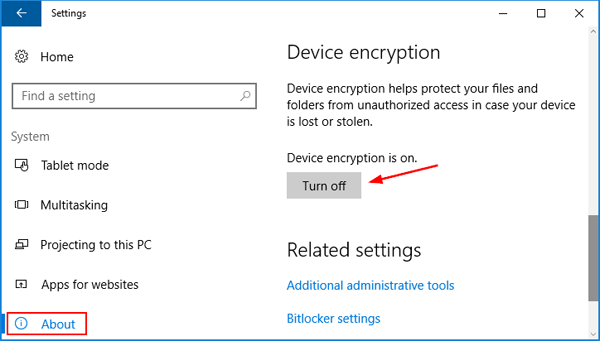
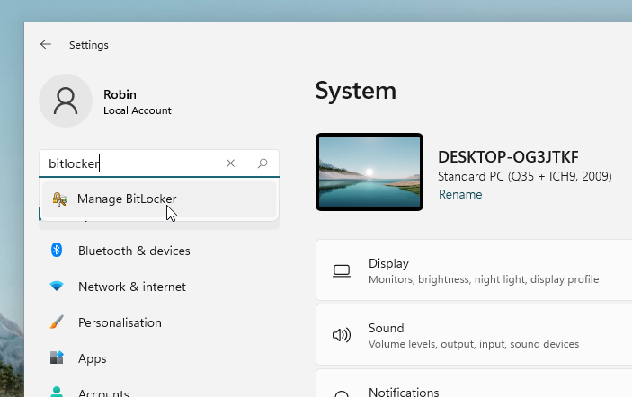
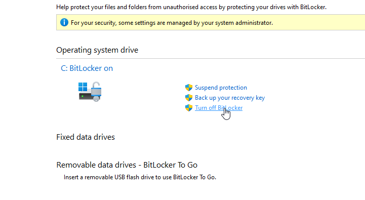

# Installeren met BitLocker uitgeschakeld

Als je Ubuntu wilt installeren en niet al te veel geeft om BitLocker is het waarschijnlijk de makkelijkste manier om Ubuntu te installeren.

## Windows 10
Start Windows op, open het Settings scherm en onder about en klik op "Turn off" bij device encryption. BitLocker zal nu worden uitgeschakeld en je schijf zal worden ontsleuteld. Je krijgt een melding wanneer de ontsleuteling voltooid is, en het zal ook zichtbaar zijn in het BitLocker-configuratiescherm. Als de ontsleuteling voltooid is kan je Ubuntu op dezelfde manier installeren als normaal.

## Windows 11

Afhankelijk van je Windows 11 versie kan het zijn dat je "BitLocker" of "Device encryption" gebruikt.

### Device encryption

In instellingen, ga naar Privacy & Security > Device encryption en schakel de versleuteling hier uit. Als je deze optie niet ziet, gebruik je waarschijnlijk geen versleuteling.

### BitLocker

In instellingen, zoek op 'BitLocker' en selecteer 'Manage BitLocker'. Als je deze optie niet ziet, gebruik je waarschijnlijk geen versleuteling.

Zet vervolgens BitLocker uit:

