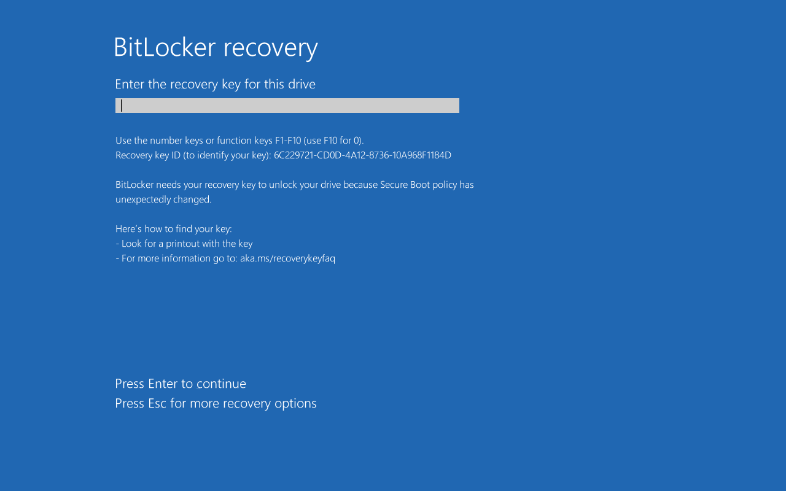

# BitLocker

**BitLocker** is een versleutelingsmechanisme van Microsoft dat de informatie op opslagmedia met behulp van encryptie onleesbaar maakt. In de context van het BYOD-programma is dit problematisch aangezien we de partitie waarop Windows draait willen verkleinen - dat kan alleen vanuit Linux als de partitie niet versleuteld is.

## Hoe weet ik of BitLocker ingeschakeld is?

Open 'Disk Management' / 'Schijfbeheer'. Dat kan door hierop te zoeken, of je kan het vinden in het <kbd>Win</kbd>+<kbd>X</kbd> menu.

Hier kijk je naar je C: schijf (en ook andere als je er meer hebt).

In het blokje staat de letter (C:), de grootte en het type bestandssysteem. Als hier alleen staat 'NTFS', gebruik je geen versleuteling. Als hier staat 'NTFS (Met BitLocker versleuteld)', of iets wat erop lijkt, dan is de partitie wel versleuteld.

## BitLocker is ingeschakeld, wat nu?

Ubuntu kan dus niet een versleutelde Windows partitie verkleinen. Dit geeft je twee opties:

1. [Versleuteling uitzetten](./bitlocker-uitschakelen.md), zodat Ubuntu de partitie wel kan verkleinen (duurt even, maar is wel het meest eenvoudig)
2. [De partitie verkleinen binnen Windows](./installeren-met-bitlocker.md), zodat Ubuntu de partitie niet hoeft te verkleinen (mogelijk sneller, maar ingewikkelder)

## BitLocker recovery

Heb je BitLocker niet uitgezet voor de Linux installatie? Dan krijg je waarschijnlijk de vraag om je herstelcode in te vullen, om weer toegang te krijgen tot je data.

Als je de stappen "Installeren met BitLocker ingeschakeld" hebt gevolgd, dan kun je de herstelcode vinden in de back-up die je hebt gemaakt.

Mocht je geen back-up hebben gemaakt, maar wel met een Microsoft account ingelogd bent binnen Windows, dan heb je waarschijnlijk nog geluk. Het is meestal mogelijk om via je Microsoft account een herstelcode te krijgen.

Als je geen eigen kopie hebt van de herstelcode en ook geen Microsoft account gebruikt, is de enige optie om Windows opnieuw te installeren en je gegevens te herstellen vanuit een back-up.
