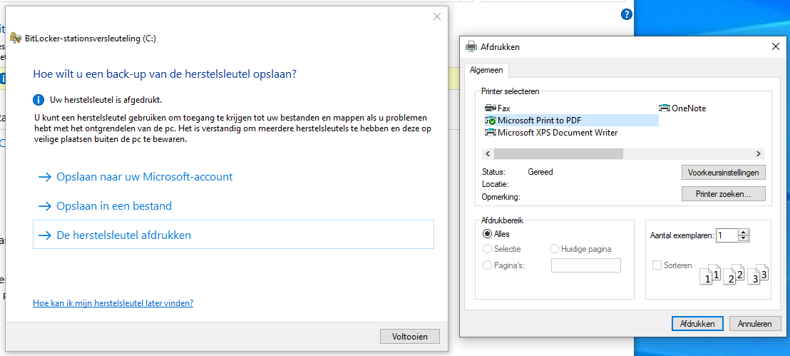
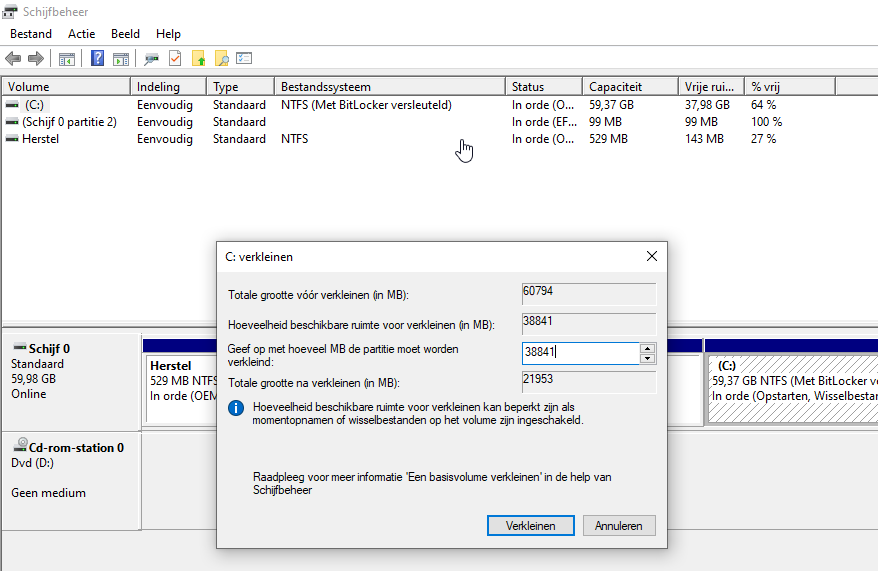

# Installeren met BitLocker ingeschakeld

!!! danger "Belangrijk"
    Als je je BitLocker-herstelsleutel niet opslaat is het mogelijk dat je je versleutelde Windows-partitie niet kunt ontsleutelen. Bewaar deze dus goed!

## Kopie maken van herstelsleutel

Het is belangrijk een kopie te maken van je BitLocker-herstelsleutel. Deze kun je als het goed is vinden in je Microsoft-account via [deze link](https://account.microsoft.com/devices/recoverykey). Als deze hier niet te vinden is, kun je hem ook lokaal vinden: in het BitLocker-venster uit de sectie hierboven zie je het item "Bitlocker settings". Klik hierop, en klik op "Back-up maken van uw herstelsleutel". Na hierop te klikken kan je kiezen om de herstelsleutel op te slaan in een bestand of af te drukken. Kies voor de laatste optie, kies dan 'Microsoft Print to PDF' en sla ergens op de schijf het PDF'je op. Open deze dan en maak een foto met je telefoon, of e-mail het naar jezelf, or whatever.

## Partitie handmatig verkleinen

Als je Ubuntu wilt installeren met BitLocker ingeschakeld, moet je enkele stappen vanuit Windows uitvoeren. Daarnaast vereist het op dit moment handmatige partitionering in de Ubuntu-installer.

Om Ubuntu te installeren met BitLocker aan moet de schijfruimte voor Ubuntu gecreëerd worden vanuit Windows; ga hiervoor naar de partitiemanager van Windows (Win+R "diskmgmt.msc"), en verklein de Windows-partitie naar de gewenste grootte.

## Ubuntu installeren

Hierna kan opnieuw worden opgestart en de installatie van Ubuntu kan worden uitgevoerd. Tijdens het partitioneren moet je niet voor de optie "Install Ubuntu alongside Windows Boot Manager" kiezen, maar voor de optie "something else". Maak dan een partitie in de vrije ruimte met als *mount point* `/`, en klik dan op "Install now".

Als je Windows opstart via het opstartmenu van Ubuntu kan om de herstelsleutel gevraagd worden - voer deze desgevraagd in. Als het goed is wordt slechts eenmalig om de herstelsleutel gevraagd, hierna kan zonder problemen in Windows opgestart worden.