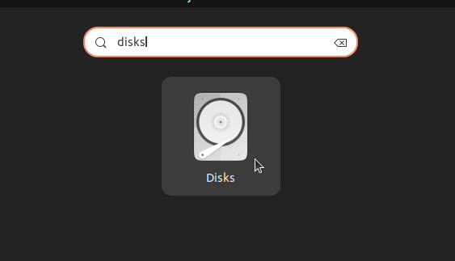
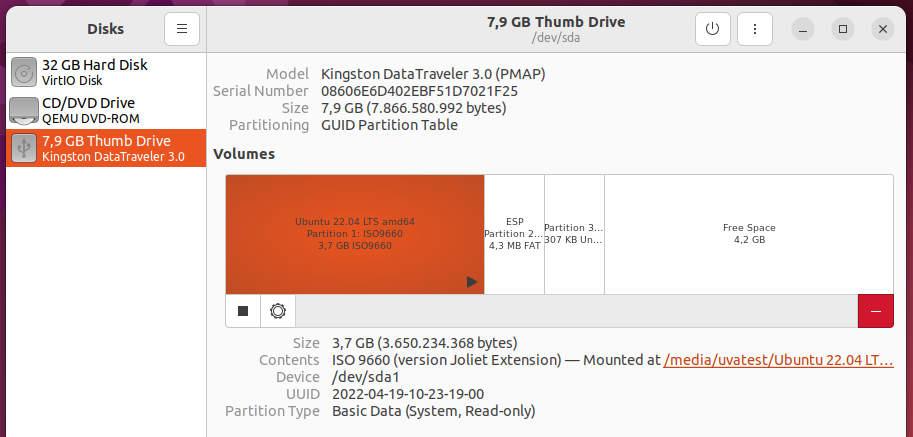
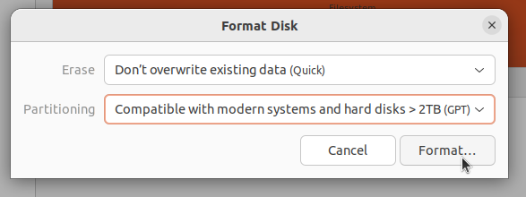
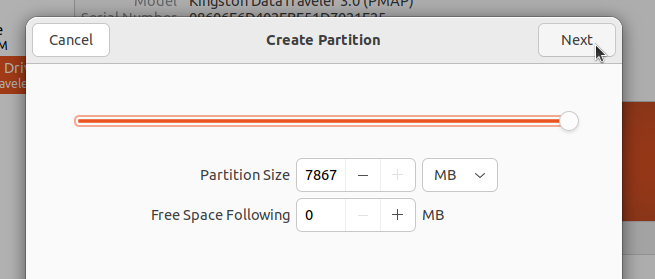
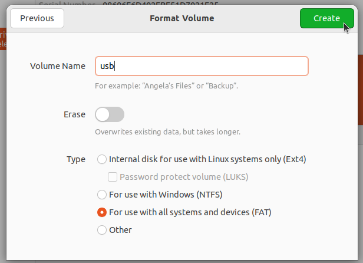
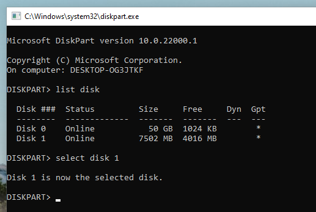
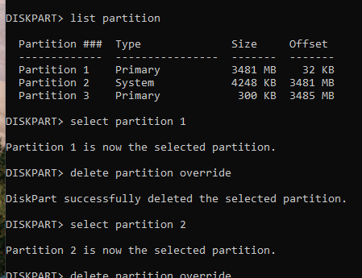

# USB herstellen

Door Linux op je USB stick te zetten heeft het een speciale partitieindeling gekregen waardoor het niet meer werkt om bestanden over te zetten tussen computers. Hier wordt beschreven hoe je dit ongedaan kunt maken. Dit kan vanuit Linux of Windows, maar vanuit Linux is makkelijker.

## Ubuntu

Open eerst de 'Disks' app:

!!! warning "Selecteer het goede station"
    Doe deze stap zorgvuldig zodat je niet per ongeluk belangrijke data vernietigd!

Selecteer je USB-stick:

Herinitialiseer de USB-stick meteen nieuw GPT partitietabel:

Nu maken we een nieuwe partitie en bestandssysteem in de lege ruimte:

## Windows

Open Run, bijvoorbeeld met de toetscombinatie <kbd>Win</kbd> + <kbd>R</kbd> en voor uit: `diskpart`.

Gebruik `list disk` en `select disk <n>` om de juiste schijf de selecteren.

!!! warning "Selecteer het goede station"
    Doe deze stap zorgvuldig zodat je niet per ongeluk belangrijke data vernietigd!

Gebruik vervolgens `list partition` en dan voor elke partitie `select partition <n>`, `delete partition override` om de partities te verwijderen.

Nu zegt `list partition` als het goed is dat er geen partities zijn. Maak een nieuwe partitie met: `create partition primary`. Uiteindelijk maak je een filesystem op deze partitie met `format quick fs=fat32`. Je bent klaar! Typ `exit` om diskpart af te sluiten.
