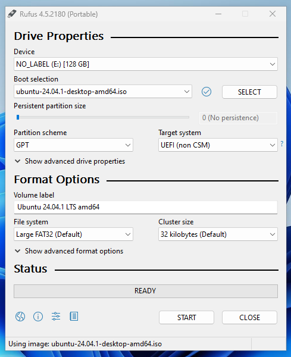

Je zal een USB-stick van ten minste 8 GiB nodig hebben. Je laptop zal meerdere keren herstarten. Het is handig om deze pagina te openen op een ander apparaat zodat je de instructies niet steeds hoeft op te zoeken.

## Troubleshooting
Gaat er iets mis tijdens of na de installatie? Kijk dan naar [de pagina met veelvoorkomende problemen](../problemen.md), vraag om hulp of stuur (als je thuis bent) een mailtje naar `laptops-fnwi@uva.nl`. Tijdens de introductiedag is er een ruimte beschikbaar voor als de installatie uitloopt, als je niet weet waar dit is kan je dit aan een assistent vragen.

## macOS

!!! warning "macOS wordt niet ondersteund"
    MacOS wordt officieel niet ondersteund door de UvA. Hoewel de meeste vakken prima in macOS gedaan kunnen worden, ben je vaak op jezelf aangewezen om het werkend te krijgen. Er zullen niet altijd instructies beschikbaar zijn voor het installeren van de benodigde software voor macOS, waar dit voor Ubuntu wel het geval is. Sommige vakken moeten misschien in een Linux virtuele machine gedaan worden. In zeldzame gevallen is het helemaal niet mogelijk bepaalde practica op macOS te doen, vooral als je een nieuwere ARM MacBook hebt.

Gebruik je macOS? Dan kan je deze instructies niet volgen. Je kan gewoon macOS gebruiken zonder Linux te installeren.

## USB-voorbereiding
In deze stap download je het ISO-bestand voor Ubuntu desktop, en zet je deze op de usb-stick.
Zorg allereerst dat je een lege USB-stick van minstens 8 GiB hebt, en sluit deze aan op je computer.

Download vervolgens het ISO-bestand van de laatste daily build van [Ubuntu 24.04.1](https://byod.segfault.party/noble-desktop-amd64.iso).

!!! note "Geleende USB-stick?"
    Als je een USB-stick van een van onze helpers hebt geleend, hoef je de USB-voorbereiding niet opnieuw te doen. Je kunt dan verder naar het kopje **Fast start-up uitschakelen**.

!!! tip "Eduroam"
    Zorg ervoor dat je met het wifi-netwerk `eduroam` verbonden bent als je het ISO-bestand downloadt; de open wifi is erg traag. Om met `eduroam` te verbinden kan je de tool gebruiken op [het wifi-portal](https://wifiportal.uva.nl).

!!! note "Geüpdatete ISO"
    Sinds 23 augustus gebruiken we *niet* de ISO die beschikbaar is op de Ubuntu-website (`ubuntu-24.04-desktop-amd64.iso`), maar specifiek de daily build die beschikbaar is via de link hierboven. Als je je USB-stick al voorbereid hebt met de oude ISO zul je dit helaas opnieuw moeten doen -- hiermee werken we om een [specifiek opstartprobleem](../sbat.md) heen.

Download het programma [Rufus](https://github.com/pbatard/rufus/releases/download/v4.4/rufus-4.4p.exe); een klein programma waarmee je de ISO naar de usb-stick kan schrijven, zonder handmatig partities te maken en bestanden te kopiëren.

Nadat je Rufus hebt geopend:

1. Selecteer je USB-stick (`Device`)
2. Selecteer het Ubuntu ISO-bestand (<kbd>SELECT</kbd> knop).
3. Zet `Partition scheme` op `GPT`
4. Druk op <kbd>START</kbd> en dan twee keer <kbd>OK</kbd>

## Fast start-up uitschakelen
*Fast start-up* is een techniek om het opstarten van Windows te versnellen, door bij het afsluiten na het beëindigen van de gebruikerssessie in sluimerstand te gaan, waarbij de systeemstaat naar de harde schijf wordt geschreven om ingeladen te worden wanneer de computer weer opstart. Fast start-up (en sluimerstand in het algemeen) maakt het onveilig om naar je Windows-partitie te schrijven vanuit Linux. Tijdens de Ubuntu installer wordt de Windows partitie verkleind om ruimte te maken voor Ubuntu, dus is het nodig om fast start-up uit te schakelen.

### Windows 10
Open Settings (via ⚙️ in Start), en ga naar:

1. `System` / `Systeem`
2. `Power & sleep` / `Energiebeheer & slaapstand` (links)
3. `Additional power settings` / `Extra energieopties` (klein linkje rechts)
4. `Choose what the power buttons do` / `Kies wat de aan- en uitknoppen doen` (klein linkje links)
5. `Change settings that are currently unavailable` (link)
6. Scroll naar beneden totdat je een lijstje met opties ziet, en schakel dan `Turn on fast start-up (recommended)` uit.
7. Tenslotte klik je dan op `Save Changes` om het te bevestigen.

### Windows 11
1. Open 'Control Panel' / 'Configuratiescherm' (bijv. door te zoeken in start menu)
2. Klik op 'Hardware and Sound' / 'Hardware en geluiden'
3. Klik op 'Power Options' / 'Energiebeheer'
4. Klik op 'Choose what the power button does'
5. Klik op 'Change settings that are currently unavailable'
6. Zet 'Turn on fast-startup (recommended)' uit.
7. Druk op 'Save Changes'

## Apparaatversleuteling

!!! danger "Deze stap is belangrijk!"
    Het staat verscholen onderaan, maar het is heel belangrijk om deze instructies goed te lezen! Als je computer gebruik maakt van versleuteling en je Linux probeert te installeren, kan het zijn dat een herstelcode nodig is om weer in Windows te komen. Als je geen back-up hebt gemaakt van deze herstelcode en geen Microsoft account gebruikt, ben je alle bestanden binnen Windows kwijt! Sowieso is het niet mogelijk om Ubuntu te installeren zonder versleuteling uit te schakelen of handmatig de partitie te verkleinen.

In Windows kan je via het zoekmenu de BitLocker-instellingen tevoorschijn toveren. Zoek op *BitLocker* of *device encryption* (Nederlands: *apparaatversleuteling*). Hier is in te zien of BitLocker aanstaat. Zie de pagina over [BitLocker](./bitlocker.md) voor meer informatie. Indien nodig, staat er ook wat je in dit geval moet doen.

!!! success "Voorbereiding af"
    Als je de USB hebt voorbereid, fast start-up uit hebt geschakeld en hebt gekeken of je rekening moet houden met apparaatversleuteling, kan je verder naar [de installatie](./installatie.md).
