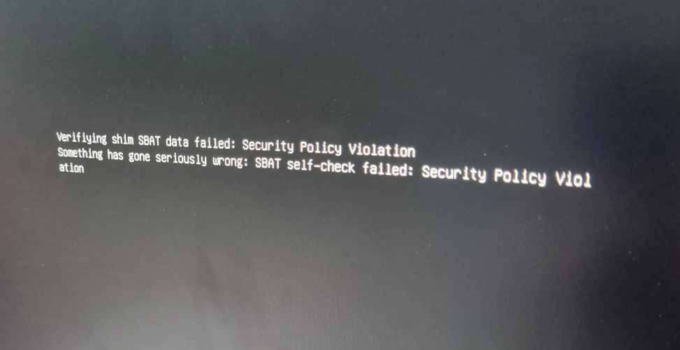

# SBAT

Als je de originele Ubuntu 24.04-ISO op je USB-stick hebt gezet en probeert op te starten kun je de volgende foutmelding tegenkomen:

Deze foutmelding is het effect van een Windows-beveiligingsupdate, die ervoor zorgt dat oude versies van Ubuntu niet kunnen opstarten. De nieuwste versie van Ubuntu, Ubuntu 24.04.1, bevat een fix hiervoor, maar deze wordt helaas pas beschikbaar op 29 augustus 2024. In plaats daarvan gebruiken we de daily build van Ubuntu 24.04.1, die beschikbaar is via onze mirror, op de volgende URL:

[https://byod.segfault.party/noble-desktop-amd64.iso](https://byod.segfault.party/noble-desktop-amd64.iso)

Download deze ISO, en schrijf deze naar je USB-stick zoals omschreven in [de voorbereiding](installatie/voorbereiding.md).
